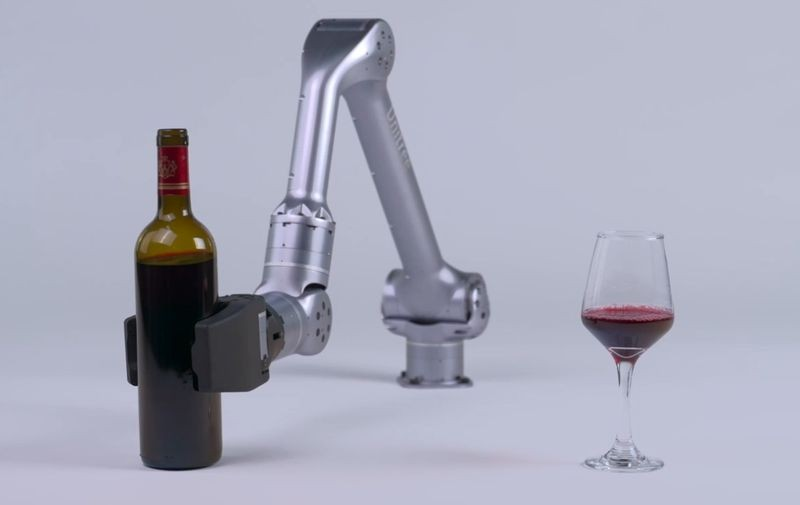

# wam-crrl
Developing industrial-level whole-arm manipulators.

    
     
    <em>Boston Dynamics Spot Arm (source: <a href="https://bostondynamics.com/products/spot/arm/">Boston Dynamics</a>)</em>

    
     
    <em>Unitree's Z1 (source: <a href="https://www.unitree.com/z1">Unitree Robotics</a>)</em>

<!-- > "This repository documents my journey in designing and building a 6-DOF robotic manipulator inspired by the Spot Arm from Boston Dynamics. The project is intended for research, learning, and development of high-performance modular manipulators."

---

## Project Goals

- Build a compact 6-DOF robotic arm with similar capabilities to Spot's manipulator
- Explore torque control, inverse kinematics, and force-based grasping
- Design modular joints using frameless BLDC motors + harmonic gears
- Simulate, prototype, and eventually deploy on a mobile robot base

---

## Research Summary

### Robotic Arm Types and Concepts
- **6 DOF Arm** – Allows full pose (position + orientation) control
- **Serial Manipulator** – One joint after another; most common type
- **End-effector** – Typically a gripper with force and position control

### Actuator Selection
- **Frameless BLDC motors** (e.g., Cubemars RI, T-Motor AK)
- **Harmonic Drives** – For zero-backlash, high-torque joints
- **Encoders** – Magnetic absolute encoders (e.g., AS5048) for joint position

### Control System
- **Low-Level**: Current/torque control of each joint
- **Mid-Level**: Joint-space trajectory planning
- **High-Level**: Cartesian planning, grasp logic

### Design Tools
- **CAD**: Fusion 360, SolidWorks
- **Simulation**: MuJoCo, PyBullet, ROS + MoveIt

---

## What’s Inside the Repo

| Folder | Description |
|--------|-------------|
| `/designs` | CAD models for joints and full arm |
| `/electronics` | Wiring diagrams, controller board plans |
| `/simulation` | Python or ROS simulations and planners |
| `/docs` | Research notes, papers, inspiration |

---

## Inspirations and References

- [Boston Dynamics Spot Arm](https://www.bostondynamics.com/spot-arm)
- [Cubemars RI Series Motors](https://www.cubemars.com/)
- [Harmonic Drive Systems](https://harmonicdrive.net/)
- Research papers on torque-controlled manipulation (links inside `/docs`)

---

## Media

You can also include:
- Diagrams of your arm design
- Simulation GIFs
- Evolution of your prototypes

---

## Future Goals

- Integrate gripper with feedback
- Test object manipulation with force/vision feedback
- Deploy on mobile robot or base platform
- Research safe human-robot interaction

---

## Author

**Jaey Kim**  
Mechanical Engineering @ NC State  
[GitHub](https://github.com/yourusername) · [LinkedIn](https://linkedin.com/in/yourprofile)

---

## License & Citation

This is a personal educational project.  
Images of the Boston Dynamics Spot Arm are included under fair use for comparative and educational purposes.  
Please cite any reused content properly. -->